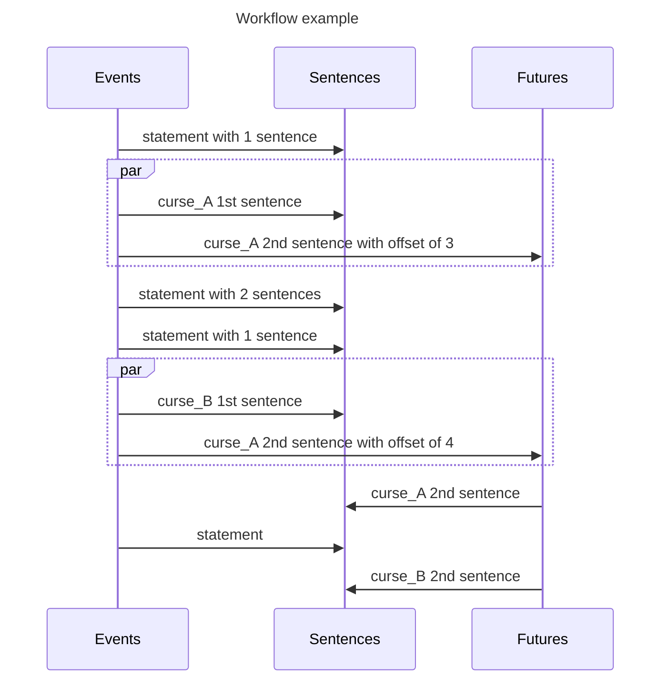

# Core mechanics implementation

While the game is in appearance pretty simple, a few events of different nature
may happen at different times and the game has to show everything in a coherent
manner. The different kinds of events and the process of building the sentences
for the front is describe below.

## Events

### Basics

1. Single statements

The most basic kind: just display the sentence as-is.

> Pas de gachis! Finis ton verre s'il est plus d'a moitie vide.

> Pas si vite! Ceux qui n'ont pas vu au tour precedent en boient le double.

> Repartis 3 gorgees sur tes deux voisins

> Joker: le maitre du jeu choisit un joueur et le punit comme il veut.

2. Multi statements

Almost the same, but all the text is not displayed at once.

> Vote: Marvel ou DC?

> Les rageux en minorite finissent leur verre.

### Varying the sips

The game won't last long if we keep chugging our drinks. Sentences should be
able to vary the quantity of sips they give. It may change from one game to
another.

> Repartis X gorgees sur tes deux voisins

### Including players

It can be fun to target players from time to time.

> Julie, cite 3 marques de pales de moteur d'avions allemands, finis le captain si tu echoues.

### Curses

To spice things up and make each game unique, curses can add a twist. They may
last a minimum number of turns, and should have expired after a maximum number
of turns.

> Interdit d'appeler quelqu'un par son prenom. 
> [X tours passent ...] 
> Vous pouvez desormais reutiliser les prenoms.

### And more

Finally, allow sentence to use all these features at the same time could allow
to create very unique games.

## Implementation

When starting a game, the backend should send a list of sentences for the frontend to display in the same order, that's it. 100% of the logic is handled behind the scenes. The only input the backend needs is the `Theme` to use, and the players' names (eventually settings and game options in the future).

### Event model

A `Event` is a JSON object, defined by a [schema](../config/schemas/event.json). The only mandatory fields are `kind` - which tells what fields we should expect further -, and `texts` - a non-empty list of sentences to be displayed.

The only exception is `sips` and `protagonists` are injected in the sentences if the patterns `{sips}` or `{player_X}` are found in the sentence.

There are different `kind`s of sentences:

- `statement`: the `texts` are displayed as-is, following each other.
- `curse`: can be seen as a modifier, it enforces a new rule for a few turns (included between [`minimumTurns`; `maximumTurns`]), for everyone or only a number of `protagonists`. It also has a `first` field which define how many sentences are displayer *before* the event, so the rest can be shown later.
- 

The exhaustive list of optional fields is given below.

### Sentences generation

When loading a theme, all `Event`s are first shuffled. Then the sentences are extracted depending on the `kind`. `Event`s that have future effects are special, because they should add at least two sentences with a different timing, so we need to first determine how long in the future the event will happen, then add the first sentences, let other be added, and finally add the rest.

That means while reading the `Event`s, we should set aside and keep track of an temporal **offset** for future events that is decreased every time a new event is added:

